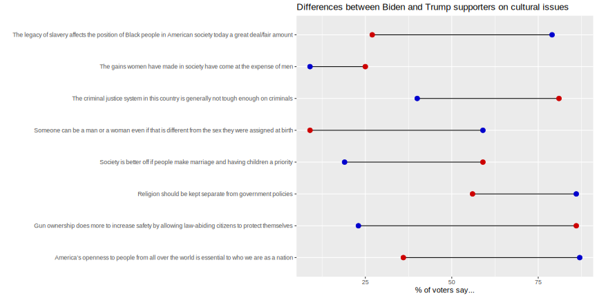
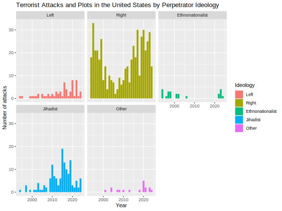

# Makeover Monday

This is my repository contributing to the [Makeover Monday Challange](https://makeovermonday.co.uk/).
The challenge is to create better, more effective visualizations with a given dataset, which comes out each Monday.

<!-- TOC -->
* [Makeover Monday](#makeover-monday)
  * [Setup](#setup)
<!-- TOC -->

## Setup
To render documents run:

``` r
rmarkdown::render("2025_45/2025_45.rmd")
```
## Weekly Submissions
### 42


### 45



